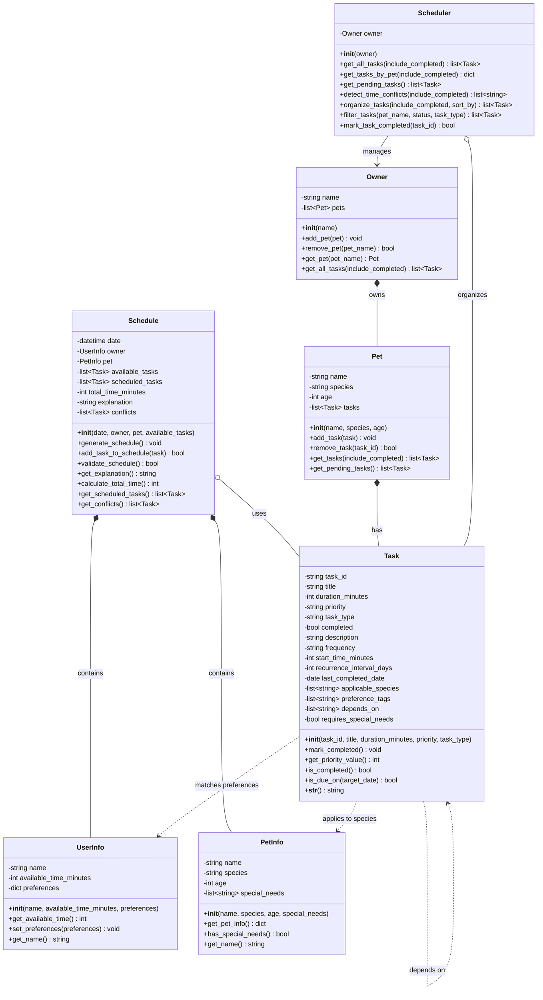

# PawPal+ Class Diagram

This diagram shows the main classes for the PawPal+ pet care planning application.

## Class Descriptions

### UserInfo
Represents the pet owner with time constraints and preferences. Stores how much time the owner has available each day and their care preferences.

### PetInfo
Contains information about the pet including name, species (dog, cat, other), age, and any special needs that might affect care scheduling.

### Task
Represents individual pet care tasks such as walks, feeding, medications, grooming, and enrichment activities. Tasks include scheduling metadata like frequency, optional start times, and recurrence details.

### Schedule
Generates optimized daily pet care schedules for a specific owner and pet. It filters available tasks, handles conflicts, and explains scheduling decisions.

### Pet
Represents a specific pet and the list of tasks assigned to it.

### Owner
Represents the pet owner and manages their pets and combined task list.

### Scheduler
Provides cross-pet utilities like sorting, filtering, conflict detection, and completing recurring tasks.

## Relationships

- **Schedule → UserInfo** (Composition `*--`): Each schedule is created for a specific owner
- **Schedule → PetInfo** (Composition `*--`): Each schedule is created for a specific pet
- **Schedule → Task** (Aggregation `o--`): Schedule uses and organizes multiple Task objects
- **Owner → Pet** (Composition `*--`): Owner manages a collection of pets
- **Pet → Task** (Composition `*--`): Pet stores its assigned tasks
- **Scheduler → Owner** (Association `-->`): Scheduler operates on a specific owner
- **Scheduler → Task** (Aggregation `o--`): Scheduler sorts and filters tasks
- **Task → Task** (Dependency `..>`): Tasks can depend on other tasks
