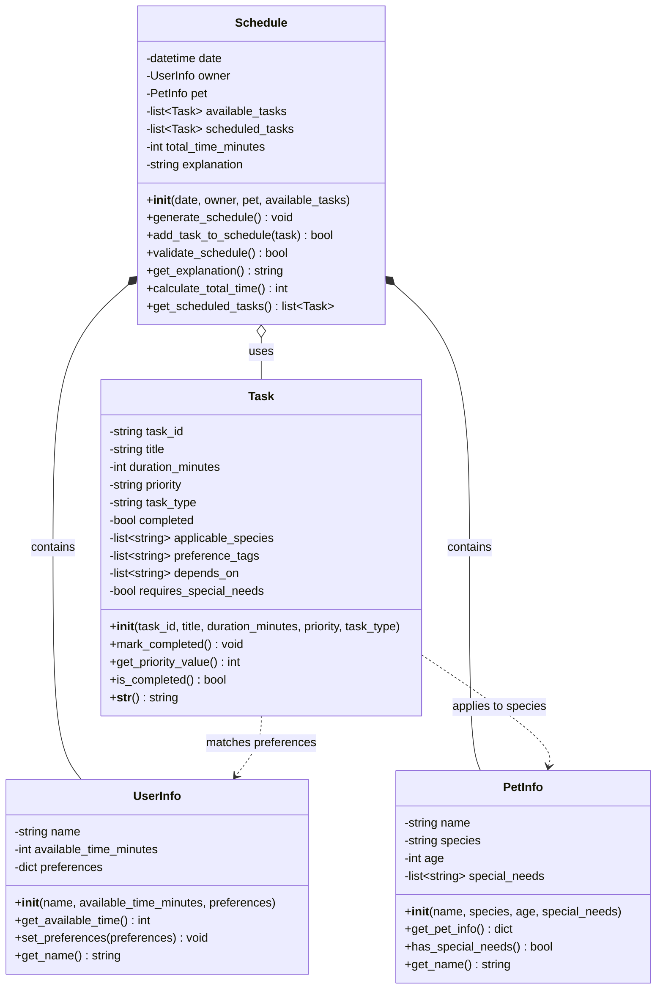

# PawPal+ Class Diagram

This diagram shows the four main classes for the PawPal+ pet care planning application.

## Class Descriptions

### UserInfo
Represents the pet owner with time constraints and preferences. Stores how much time the owner has available each day and their care preferences.

### PetInfo
Contains information about the pet including name, species (dog, cat, other), age, and any special needs that might affect care scheduling.

### Task
Represents individual pet care tasks such as walks, feeding, medications, grooming, and enrichment activities. Each task has a duration, priority level, and type.

### Schedule
The main orchestrator class that generates optimized daily pet care schedules. It considers the owner's available time, pet needs, and task priorities to create a feasible plan with explanations.

## Relationships

- **Schedule → UserInfo** (Composition `*--`): Each schedule is created for a specific owner
- **Schedule → PetInfo** (Composition `*--`): Each schedule is created for a specific pet
- **Schedule → Task** (Aggregation `o--`): Schedule uses and organizes multiple Task objects
